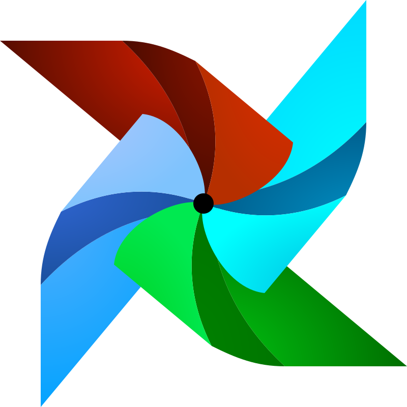

## Software engineer and open-source contributor in Computer Vision, Machine Learning, and DevOps space.

  
  <!--  -->
  
  
  

#### Now

- ✨ Currently Contributing to [datumaro](https://github.com/openvinotoolkit/datumaro); [
  OpenWallet Foundation ](https://github.com/openwallet-foundation)
- :calendar: Looking for contributing to open-source project on Computer Vision, Machine Learning, and DevOps domain

#### Bio

- 🏢 I'm currently working at [Reveal AI](http://revealai.de/)
- ⚙️ I use daily: `.py`, `.ts`, `.tsx`, `.yml`, `.sh`
- 🌍 I'm mostly active within the **Python Community**
- 🌱 Learning all about **Computer Vision**, **Machine Learning** and **DevOps**

#### Current Stack

            

#### Development:

<b>⚡ Github Stats</b>

<!-- <b>&#128200; Competitive Programming</b>

#### Recent Activity

<b> &#9749; Latest Medium Blogs</b>

<a target="_blank" href="https://github-readme-medium-recent-article.vercel.app/medium/@ibraym/0">

 -->

#### Connect

### Support

